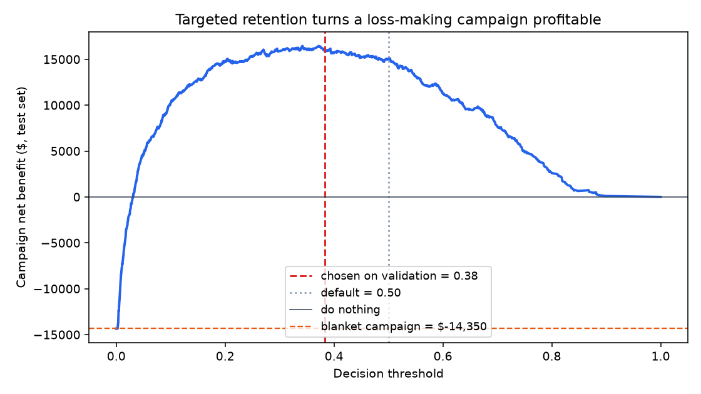
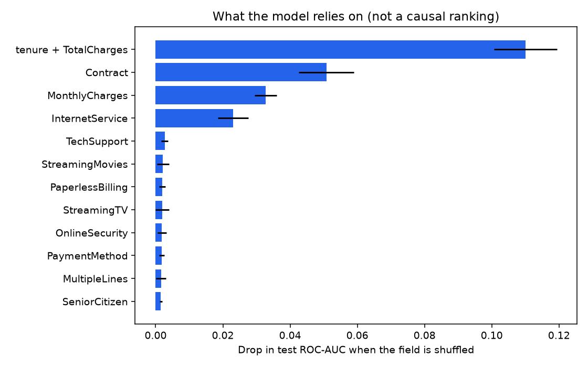
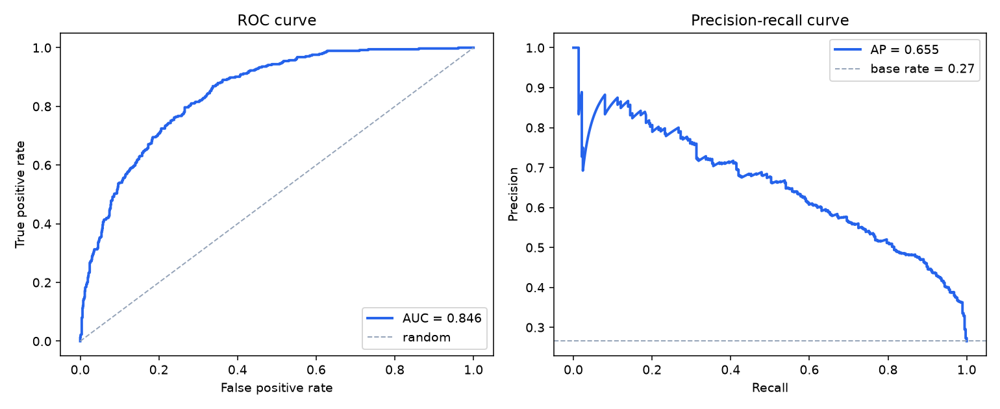
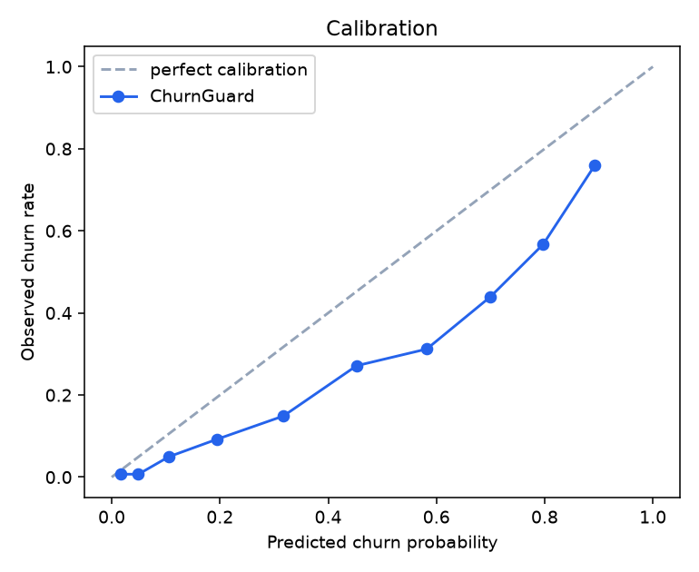

# ChurnGuard

**Cost-sensitive customer churn prediction — from raw CSV to a served API.**

[](https://github.com/som0111/churn-guard/actions/workflows/ci.yml)
[](https://www.python.org/downloads/)
[](LICENSE)
[](https://github.com/astral-sh/ruff)

**[▶ Try the live API](https://churn-guard-qj1j.onrender.com/docs)** — score a customer in your browser.
*(Free tier: the first request after a quiet spell takes ~50s to wake the instance.)*

> Most churn projects stop at "85% accuracy." That number is worse than useless here — predicting
> *nobody* churns scores 73% on this dataset. ChurnGuard optimises the thing the business actually
> pays for: **the profit of the retention campaign the model triggers.**

On a held-out test set of 1,409 customers, the model-targeted campaign returns **+$15,900** where the
blanket "email everyone" campaign that most teams actually run **loses $14,350** — a **$30,250
swing**, or **$11.28 of margin per customer scored**. The threshold behind that number was chosen on
a separate validation split, not on the test set.

---

## Results

Held-out test set (1,409 customers). Data is split 60/20/20 (4,225 train / 1,409 validation /
1,409 test, stratified): **train** is for model selection (cross-validation), **validation** is for
choosing the decision threshold, and **test** is scored once with that threshold frozen.

| Metric | Value | Why it's here |
|---|---|---|
| **ROC-AUC** | **0.846** | Ranking quality — the part the model controls |
| **PR-AUC** | **0.654** | Honest view under a 26.5% base rate |
| Brier score | 0.136 | Constant base-rate predictor scores 0.195 (lower is better) |
| Expected calibration error (ECE) | 0.020 | Mean gap between predicted and observed churn rate — see [Calibration](#calibration) |
| Recall @ tuned threshold | **67.7%** | 253 of 374 real churners caught |
| Precision @ tuned threshold | 57.4% | Above the 33% break-even precision the cost model demands |
| Accuracy | 78.1% | Reported last, on purpose — see below |

### Model selection

Three candidates, 5-fold stratified cross-validation on the training split only.

| Model | CV ROC-AUC | CV PR-AUC | CV F1 | Fit time |
|---|---|---|---|---|
| **Logistic regression** ✅ | **0.8501 ± 0.0135** | 0.6659 | 0.633 | 6.8s |
| Random forest | 0.8482 ± 0.0116 | 0.6713 | 0.633 | 8.6s |
| Gradient boosting (HistGB) | 0.8419 ± 0.0111 | 0.6578 | 0.624 | 2.9s |

The tuned gradient booster did **not** beat regularised logistic regression, and the gap between all
three is inside one standard deviation. When a linear model ties an ensemble, the linear model wins:
it trains faster, ships smaller, and its coefficients are defensible to a retention manager. That is
the finding, not a disappointment.

### The business case



| Strategy | Campaign profit | Customers targeted |
|---|---|---|
| Do nothing | $0 | 0 |
| Blanket campaign (offer to everyone) | **−$14,350** | 1,409 |
| Model @ default 0.50 threshold | +$15,050 | — |
| **Model @ 0.38 threshold (tuned on validation)** | **+$15,900** | 441 |

On the validation split the same threshold earns $16,950, so the gap to the test figure is the
honest cost of tuning on one sample and scoring on another. All rows above are test-set numbers.

Cost assumptions, all declared in [`config.py`](src/churnguard/config.py) and easy to change:
a $50 retention offer, $500 customer lifetime value, and a 30% chance the offer actually saves a
customer who was going to leave. That makes a caught churner worth **+$100** and a wasted offer
worth **−$50**, so the campaign only breaks even above **33% precision** — which is exactly the
constraint the threshold search solves for.

Move those three numbers and the optimal threshold moves with them. That is the point: the threshold
is an output of the business model, not a hardcoded 0.5.

### What drives churn



Permutation importance on held-out data (drop in test ROC-AUC when a feature is shuffled):

1. **`tenure`** (−0.375) — by a wide margin. Churn is overwhelmingly an early-life problem.
2. **`TotalCharges`** (−0.096) — proxy for accumulated relationship value.
3. **`Contract`** (−0.046) — month-to-month customers have no exit friction.
4. **`MonthlyCharges`** (−0.032) — price sensitivity.
5. **`InternetService`** (−0.024) — fiber customers churn hardest, the classic signal in this dataset.

**Actionable read:** the highest-leverage intervention is moving new fiber customers onto an annual
contract inside their first six months, not discounting the back book.

### Model quality




### Calibration

The cost model multiplies predicted probabilities by dollar values, so miscalibrated probabilities
would silently mis-price the campaign. This was audited on the validation split
([`reports/calibration_comparison.json`](reports/calibration_comparison.json)), comparing four ways of
producing probabilities from the selected logistic regression. Calibrators are fit by 5-fold CV on the
training split only.

| Variant | Brier | ECE | Mean predicted (observed 0.265) |
|---|---|---|---|
| `class_weight="balanced"` (the original) | 0.1655 | **0.142** | 0.407 |
| **No class weights** ✅ | **0.1369** | **0.019** | 0.260 |
| Balanced + sigmoid | 0.1368 | 0.022 | 0.261 |
| Balanced + isotonic | 0.1372 | 0.032 | 0.259 |

**The original `balanced` model was not calibrated:** it predicted a 40.7% average churn rate for a
population that churns at 26.5%, and its Brier score (0.1655) was only modestly better than the 0.195
a constant base-rate predictor gets. Winner: **no class weights** — lowest Brier + ECE (sigmoid ties on Brier,
0.1368 vs 0.1369, but has higher ECE and adds a calibrator for no gain). On the test
split the winner scores Brier 0.136 and ECE 0.020. Ranking quality is essentially unchanged (test ROC-AUC 0.8464 → 0.8463, PR-AUC 0.6563 → 0.6548); what moved is the probability scale, so the profit-tuned threshold fell from 0.64 to
0.38. ECE here uses 10 equal-count bins, and the validation split was used both to pick the variant and
to tune the threshold, so the figures carry a small selection effect.

---

## Quickstart

```bash
git clone https://github.com/som0111/churn-guard.git
cd churn-guard

pip install -c constraints.txt -e ".[dev]"   # pinned install
python -m churnguard.train  # download data, train, evaluate, write figures (~35s)
pytest                      # 63 tests
uvicorn churnguard.api:app --reload
```

**Production Python is 3.12** (Docker, Render and the instructions here). CI runs 3.12 and also 3.11
as a compatibility check. `pyproject.toml` is the single source of truth for dependencies;
[`constraints.txt`](constraints.txt) pins every resolved version, so a fresh clone installs exactly
what the reported metrics were produced with. To regenerate the pins after changing dependencies:
resolve `pip install ".[dev]"` for Python 3.12 and write the result back to `constraints.txt`
(NumPy is held below 2.5 and SciPy below 1.18 so the same pins also install on 3.11).

Interactive API docs: <http://127.0.0.1:8000/docs>

### Scoring a customer

```bash
curl -X POST http://127.0.0.1:8000/predict \
  -H "Content-Type: application/json" \
  -d '{"tenure": 1, "Contract": "Month-to-month", "InternetService": "Fiber optic",
       "PaymentMethod": "Electronic check", "TechSupport": "No", "OnlineSecurity": "No",
       "MonthlyCharges": 95.0, "TotalCharges": 95.0}'
```

```json
{
  "churn_probability": 0.7092,
  "will_churn": true,
  "risk_band": "high",
  "threshold_used": 0.3837,
  "recommended_action": "Priority outreach: call within 48h and offer a contract upgrade."
}
```

The API returns an **action**, not just a number. A retention analyst can act on the response
without knowing what a probability is.

| Endpoint | Purpose |
|---|---|
| `GET /` | Redirects to the interactive docs |
| `POST /predict` | Score one customer |
| `POST /predict/batch` | Score up to 1,000 in one call |
| `GET /health` | Liveness + which model artifact is loaded |
| `GET /metrics` | Full evaluation report from the last training run |

### Docker

```bash
docker build -t churnguard .
docker run -p 8000:8000 churnguard
```

The image is based on `python:3.12.7-slim-bookworm`, installs with the pinned `constraints.txt`, and
trains the model at build time, so the container starts ready to serve. Pass
`--build-arg GIT_SHA=$(git rev-parse --short HEAD)` to record the commit in the model report.

### Deployment

The live instance runs on Render's free tier, configured by [`render.yaml`](render.yaml):

```yaml
buildCommand: pip install -c constraints.txt -e . && python -m churnguard.train --skip-figures
startCommand: uvicorn churnguard.api:app --host 0.0.0.0 --port $PORT
```

**The model is trained during the build rather than committed.** Two reasons: the pickled artifact
is always produced by the exact scikit-learn build that will load it, sidestepping version-skew
bugs — and every deploy re-proves that the pipeline runs end to end on a clean machine.

It worked at the previous commit: the deployed instance returned `0.8336` (pre-Fix-1 model) for the customer above, byte-identical to a local
run on a different OS and Python version. That is what the fixed `random_state` is for.

Pushing to `main` triggers CI and a redeploy. Free instances sleep after 15 minutes idle, so the
first request back takes ~50 seconds.

---

## How it works

```
data/raw/telco_churn.csv
        │
        ▼
   data.clean()          fix TotalCharges dtype, handle 11 zero-tenure blanks,
        │                de-duplicate, encode target
        ▼
   data.split()          stratified 60/20/20 train / validation / test
        │
        ▼
┌──────────────────────────── sklearn Pipeline ────────────────────────────┐
│  add_domain_features()   avg_monthly_spend, spend_vs_current_ratio,      │
│         │                n_addon_services, tenure_years, is_new_customer │
│         ▼                                                                │
│  ColumnTransformer       median impute + scale  |  mode impute + one-hot  │
│         │                                                                │
│         ▼                                                                │
│  Estimator               selected by 5-fold CV ROC-AUC                    │
└──────────────────────────────────────────────────────────────────────────┘
        │
        ▼
  optimize_threshold()    maximise campaign profit on the VALIDATION split;
        │                 test is then scored once at that frozen threshold
        │
        ▼
  churn_pipeline.joblib ──────► FastAPI /predict
```

**Everything lives inside one `Pipeline` object.** Feature engineering, imputation and encoding are
fitted stages, not a notebook cell that ran once. The API loads that exact object, so training and
serving cannot drift apart — the single most common way a working model breaks in production.

### Project structure

```
churn-guard/
├── src/churnguard/
│   ├── config.py       paths, schema, and the business cost model
│   ├── data.py         download, clean, 60/20/20 split
│   ├── features.py     domain features + preprocessing pipeline
│   ├── train.py        model comparison, selection, model card
│   ├── evaluate.py     metrics, threshold optimisation, figures
│   └── api.py          FastAPI serving layer
├── tests/              63 tests: data contracts, validation, integrity, provenance, features, costs, API
├── reports/            metrics.json + generated figures
├── models/             fitted pipeline + model card
├── .github/workflows/  CI on Python 3.12 (production) and 3.11 (compatibility)
├── render.yaml         free-tier deployment blueprint
├── constraints.txt     pinned dependency versions (generated from pyproject.toml)
├── Dockerfile
└── Makefile
```

---

## Engineering decisions worth defending

**Accuracy is reported last.** With a 73/27 split, a model that predicts "nobody churns" scores 73%
accuracy and is worth exactly $0. ROC-AUC and PR-AUC drive selection; profit drives the threshold.

**No resampling and no class weights.** SMOTE distorts predicted probabilities, and this project
multiplies those probabilities by dollar values. `class_weight="balanced"` distorts them too: it
was the original choice, and the calibration audit showed it inflated the mean predicted churn rate
from 26.5% to 40.7% (ECE 0.142). The final model is trained unweighted (ECE 0.019); the profit
threshold, not the loss function, is what handles the class imbalance.

**The 11 blank `TotalCharges` values are not missing data.** Every one belongs to a customer with
`tenure == 0` — billed for the first time after the snapshot. Their true total is $0. Dropping them
would quietly delete the newest customers, who are the highest-churn segment in the dataset. There's
[a test](tests/test_data.py) pinning this.

**Three splits, three jobs.** Train is used for model selection (5-fold CV) only. The profit
threshold is tuned on a separate validation split, searching every unique predicted probability (plus
0 and 1) rather than a fixed grid. The test split is scored once at that frozen threshold, so the
headline profit never saw test labels when its threshold was picked. The first version of this
project tuned the threshold on the test set; fixing that moved the headline from +$16,250 to +$15,900.

**Permutation importance, not `.coef_`.** Coefficients on one-hot encoded, scaled features are easy
to misread. Permutation importance is measured on held-out data and answers the question a
stakeholder actually asks: *how much worse is this model without that column?*

---

## Testing

```bash
pytest -v
```

63 tests across six areas:

- **Data contracts** — the target is binary, the zero-tenure fix holds, the train/validation/test
  splits are disjoint and stratified, and neither the target nor the customer ID can leak into features.
- **Validation** — missing columns, bad target values, malformed numerics, unknown categories and
  invalid `CostModel` values fail early with a readable message; out-of-range, NaN and infinite API
  inputs return a clean 422.
- **Integrity and provenance** — a tampered dataset raises `DatasetIntegrityError`, and the model
  report contains the git SHA, dataset hash, hyperparameters and library versions.
- **Feature engineering** — zero tenure never divides by zero, add-on counting is correct.
- **Cost model** — the confusion-matrix arithmetic, that the tuned threshold never loses to 0.5 on
  validation, that an optimum between old grid points is found, and that test labels never enter the search, plus ECE and reliability-table checks.
- **API** — schema validation rejects bad input, batch order is preserved, and a new month-to-month
  fiber customer must score higher than a two-year contract holder. That last one is a behavioural
  test: it fails if the pipeline is ever wired up backwards.

CI runs lint, a full training run, and the suite on three Python versions on every push.

---

## Honest limitations

- **Static snapshot.** No time dimension, so this predicts *who looks like a churner*, not *when*.
  A survival model (Cox / Kaplan-Meier) is the right upgrade for timing.
- **Cost parameters are assumptions.** The $50 / $500 / 30% figures are illustrative. The framework
  is the contribution; real numbers would come from the finance team.
- **No drift monitoring.** A production deployment needs input-distribution and performance
  monitoring — the `/metrics` endpoint is the hook for it, not the solution.
- **The 30% offer success rate is uncausal.** Properly measuring it requires an uplift model trained
  on a randomised holdout, which is the honest next step.

## Roadmap

- [ ] Uplift modelling — target *persuadable* customers, not merely likely churners
- [ ] Survival analysis for time-to-churn
- [ ] SHAP values for per-customer explanations in the API response
- [ ] Drift monitoring + scheduled retraining

---

## Data

[IBM Telco Customer Churn](https://raw.githubusercontent.com/IBM/telco-customer-churn-on-icp4d/master/data/Telco-Customer-Churn.csv)
— 7,043 customers, 21 columns, 26.5% churn rate. Downloaded automatically on first run; not
committed to the repo. The file is verified against a pinned SHA-256 on download and on every load
(`16320c9c…e91`, 970,457 bytes); a mismatch raises `DatasetIntegrityError` instead of silently
training on different data.

## Input validation

Bad data or config fails early instead of training on garbage:

- **Raw data** is checked right after load (`data.validate_raw`): required columns, non-null customer
  ID, target in `{Yes, No}`, every categorical within its allowed set, numeric columns parseable and
  in range. One error lists every problem found. Blank `TotalCharges` is still accepted — those are the
  documented tenure-0 customers.
- **`CostModel`** raises `ValueError` for a negative offer cost or lifetime value, or a success rate
  outside `[0, 1]` (NaN included).
- **API** requests are bounded (tenure 0–100, `MonthlyCharges` ≤ 1,000, `TotalCharges` ≤ 100,000,
  no NaN/Infinity) and carry one conservative consistency check: a customer with tenure 0 cannot have
  `TotalCharges` above one month's charge. 422 responses list the field and message only; they do not
  echo the rejected input back.

## Model provenance

Every training run writes a `provenance` block to `reports/metrics.json` (served by `/metrics`):
`model_version` (`<git sha>-<UTC timestamp>`), git SHA and whether the tree was dirty, dataset URL and
SHA-256, selected estimator and its hyperparameters, calibration and threshold methods, NumPy /
pandas / scikit-learn / SciPy / joblib / Python versions, and train / validation / test counts with
class rates. The committed report was produced on Python 3.11.9 with the pinned versions; the same
metrics came out of an earlier run on Python 3.14 with unpinned latest libraries, so the results
are not sensitive to these versions on this machine. They have not been re-run on 3.12 or Linux.

## License

MIT — see [LICENSE](LICENSE).
