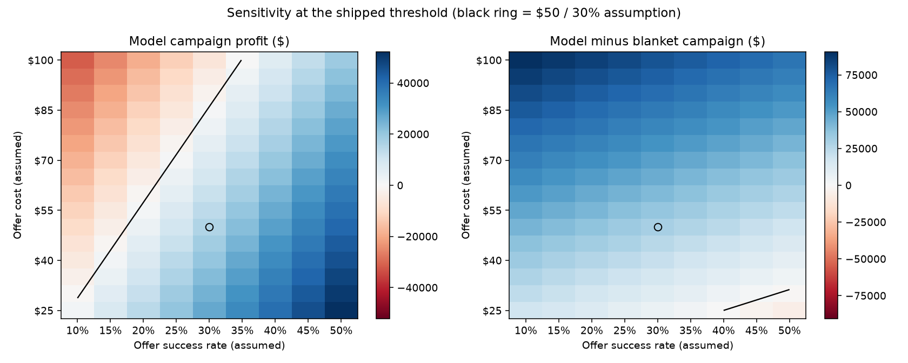
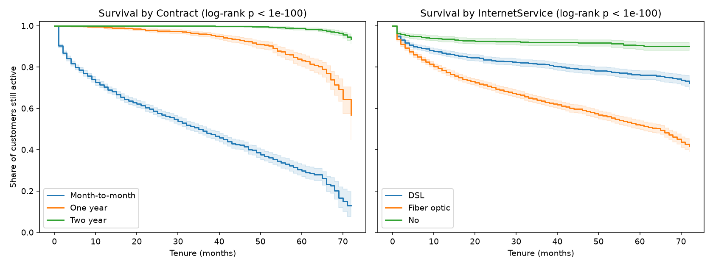
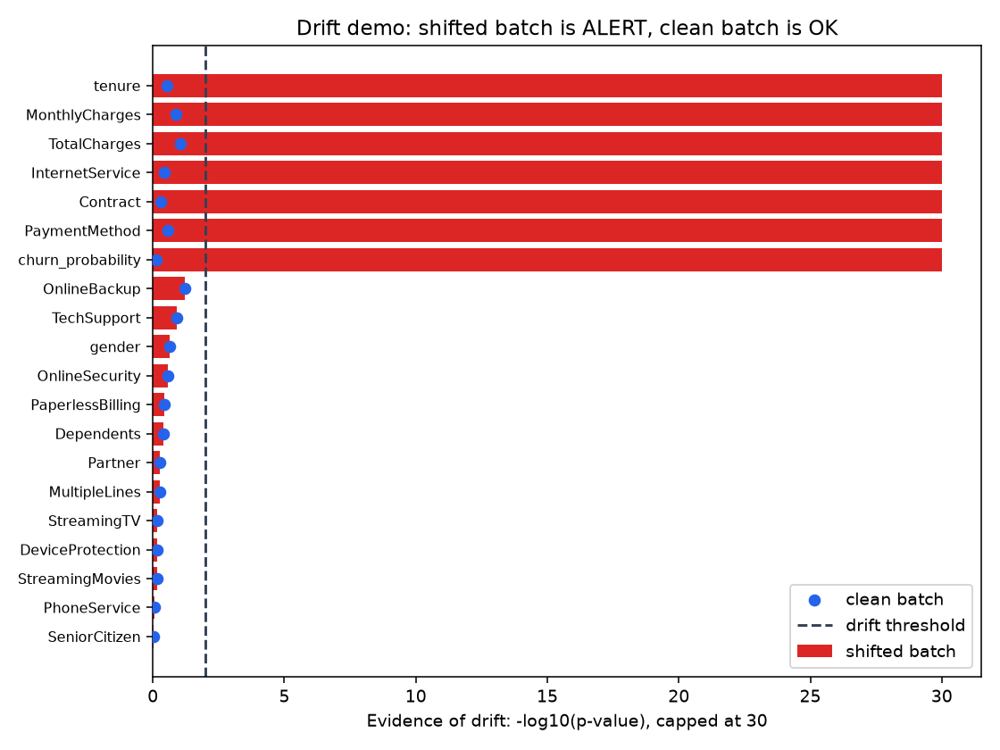

# ChurnGuard

**Cost-sensitive customer churn prediction — from raw CSV to a served API.**

[](https://github.com/som0111/churn-guard/actions/workflows/ci.yml)
[](https://www.python.org/downloads/)
[](LICENSE)
[](https://github.com/astral-sh/ruff)

**[▶ Try the live API](https://churn-guard-api.onrender.com/docs)** — score a customer in your browser.
*(Free tier: an idle instance sleeps and the first request after it can take most of a minute to wake — 43s
was observed on 2026-10-02; a warm request took under a second. This public endpoint is an
**unauthenticated demo**: no API key, no rate limit — do not send real customer data to it.)*

> Most churn projects stop at "85% accuracy." That number is worse than useless here — predicting
> *nobody* churns scores 73% on this dataset. ChurnGuard optimises the thing the business actually
> pays for: **the profit of the retention campaign the model triggers.**

On a held-out test set of 1,409 customers, a model-targeted retention campaign is projected to net
**+$15,900 (90% interval $13,000 to $18,600)**, where the blanket "email everyone" campaign **loses $14,350**
(interval −$18,850 to −$10,450) — a **$30,250 swing**, or **$11.28 of margin per customer scored**. These are
*projections under assumed costs*, not observed outcomes: a $50 offer, $500 customer value and a 30% save rate
(see [sensitivity](#how-sensitive-is-this-to-the-assumptions) and
[what this project does not prove](#what-this-project-does-not-prove)). The threshold behind that number was
chosen on a separate validation split, not on the test set.

More detail: [CHANGELOG](CHANGELOG.md) (what changed, with before/after numbers) ·
[docs/DECISIONS.md](docs/DECISIONS.md) (why each choice was made).

---

---

## Results

Held-out test set (1,409 customers). Data is split 60/20/20 (4,225 train / 1,409 validation /
1,409 test, stratified): **train** is for model selection (cross-validation), **validation** is for
choosing the decision threshold, and **test** is scored once with that threshold frozen.

| Metric | Value | Why it's here |
|---|---|---|
| **ROC-AUC** | **0.846** | Ranking quality — the part the model controls |
| **PR-AUC** | **0.654** | Honest view under a 26.5% base rate |
| Brier score | 0.136 | Constant base-rate predictor scores 0.195 (lower is better) |
| Expected calibration error (ECE) | 0.020 | Mean gap between predicted and observed churn rate — see [Calibration](#calibration) |
| Recall @ tuned threshold | **67.7%** | 253 of 374 real churners caught |
| Precision @ tuned threshold | 57.4% | Above the 33% break-even precision the cost model demands |
| Accuracy | 78.1% | Reported last, on purpose — see below |

### How certain is it?

Bootstrap of the 1,409 test customers (1,000 seeded resamples, 90% percentile intervals) at the
frozen 0.38 threshold:

| Quantity | Point estimate | 90% interval |
|---|---|---|
| Model campaign profit | +$15,900 | $13,000 to $18,600 |
| Blanket campaign profit | −$14,350 | −$18,850 to −$10,450 |
| Do nothing | $0 | $0 |
| ROC-AUC | 0.846 | 0.828 to 0.864 |
| PR-AUC | 0.655 | 0.610 to 0.696 |
| Precision | 57.4% | 53.3% to 61.2% |
| Recall | 67.7% | 63.7% to 71.6% |

This captures sampling noise in the test customers only. It does not include uncertainty in how the
threshold was chosen, in the model fit, or — the biggest one — in the cost assumptions below.

### Model selection

Three candidates, 5-fold stratified cross-validation on the training split only.

| Model | CV ROC-AUC | CV PR-AUC | CV F1 | Fit time |
|---|---|---|---|---|
| **Logistic regression** ✅ | **0.8501 ± 0.0135** | 0.6659 | 0.633 | 6.8s |
| Random forest | 0.8482 ± 0.0116 | 0.6713 | 0.633 | 8.6s |
| Gradient boosting (HistGB) | 0.8419 ± 0.0111 | 0.6578 | 0.624 | 2.9s |

The tuned gradient booster did **not** beat regularised logistic regression, and the gap between all
three is inside one standard deviation. When a linear model ties an ensemble, the linear model wins:
it trains faster, ships smaller, and its coefficients are defensible to a retention manager. That is
the finding, not a disappointment.

### The business case


| Strategy | Campaign profit | Customers targeted |
|---|---|---|
| Do nothing | $0 | 0 |
| Blanket campaign (offer to everyone) | **−$14,350** | 1,409 |
| Model @ default 0.50 threshold | +$15,050 | — |
| **Model @ 0.38 threshold (tuned on validation)** | **+$15,900** | 441 |

On the validation split the same threshold earns $16,950, so the gap to the test figure is the
honest cost of tuning on one sample and scoring on another. All rows above are test-set numbers.

**Assumptions, not observed outcomes.** Cost assumptions, all declared in [`config.py`](src/churnguard/config.py) and easy to change:
a $50 retention offer, $500 customer lifetime value, and a 30% chance the offer actually saves a
customer who was going to leave. That makes a caught churner worth **+$100** and a wasted offer
worth **−$50**, so the campaign only breaks even above **33% precision** — which is exactly the
constraint the threshold search solves for.

Move those three numbers and the optimal threshold moves with them. That is the point: the threshold
is an output of the business model, not a hardcoded 0.5.

### How sensitive is this to the assumptions?



The **$50 offer / $500 value / 30% save rate are assumptions, not measured results.** The grid above
re-prices the *shipped* threshold (0.38, not re-tuned) across save rate 10–50% and offer cost $25–$100.

- **The campaign loses money in 45 of 144 cells** — when the save rate is low relative to the offer
  cost. At $50 per offer it needs about a 20% save rate to turn a profit (−$3,075 at 15%, +$3,250 at
  20%); at $100 it needs about 35%. If the real save rate is 10%, this campaign loses $9,400 at $50.
- **The model beats the blanket campaign in 140 of 144 cells.** Blanket mailing only ties or wins when
  offers are very cheap and very effective ($25 at 40%+ save rate, $30 at 50%). Outside that corner,
  targeting beats the blanket campaign everywhere on this grid.

### What the model relies on


Permutation importance on held-out data: how much test ROC-AUC the model **loses** when a field is shuffled.
This describes the *model*, not the world — a field the model leans on is **strongly associated with higher
predicted churn**, which is not evidence that changing it would change anyone's behaviour.

| Field | AUC lost when shuffled |
|---|---|
| **`tenure` + `TotalCharges`** (shuffled together) | **0.110** |
| `Contract` | 0.051 |
| `MonthlyCharges` | 0.033 |
| `InternetService` | 0.023 |
| every other field | ≤ 0.003 each |

- **Shorter tenure and month-to-month contracts are strongly associated with higher predicted churn**, and
  fiber-optic customers have higher observed churn than DSL customers in this dataset. The survival analysis
  below shows the same pattern in time-to-churn terms.
- **`tenure` and `TotalCharges` are shuffled as one block on purpose.** An earlier version shuffled `tenure`
  alone and reported a drop of 0.375 — more than the model's whole headroom above a coin flip (0.846 − 0.5 =
  0.346). Cause: `avg_monthly_spend` is `TotalCharges ÷ tenure`, so shuffling tenure against a fixed
  `TotalCharges` manufactures impossible customers (that feature's 99th percentile goes from $115 to
  $6,327; `spend_vs_current_ratio` from 1.2 to 68.0), and the model's score on them is worse than random
  (AUC 0.452). The 0.375 measured how badly the model copes with nonsense rows, not how much it needs tenure.
  Shuffling the five tenure-derived features together in the model's own input space gives 0.114, in line with
  the joint 0.110. Reproduce with
  [`scripts/investigate_permutation_importance.py`](scripts/investigate_permutation_importance.py).
- Importance is split across redundant features: `tenure`, `tenure_years` and `is_new_customer` lose only
  ~0.017 each when shuffled alone, because the others still carry the signal.
- `spend_vs_current_ratio` is this month's charge divided by the customer's *lifetime average* charge. It is
  **not** a measured price rise — the dataset has no billing history.

### Model quality


### Calibration

The cost model multiplies predicted probabilities by dollar values, so miscalibrated probabilities
would silently mis-price the campaign. This was audited on the validation split
([`reports/calibration_comparison.json`](reports/calibration_comparison.json)), comparing four ways of
producing probabilities from the selected logistic regression. Calibrators are fit by 5-fold CV on the
training split only.

| Variant | Brier | ECE | Mean predicted (observed 0.265) |
|---|---|---|---|
| `class_weight="balanced"` (the original) | 0.1655 | **0.142** | 0.407 |
| **No class weights** ✅ | **0.1369** | **0.019** | 0.260 |
| Balanced + sigmoid | 0.1368 | 0.022 | 0.261 |
| Balanced + isotonic | 0.1372 | 0.032 | 0.259 |

**The original `balanced` model was not calibrated:** it predicted a 40.7% average churn rate for a
population that churns at 26.5%, and its Brier score (0.1655) was only modestly better than the 0.195
a constant base-rate predictor gets. Winner: **no class weights** — lowest Brier + ECE (sigmoid ties on Brier,
0.1368 vs 0.1369, but has higher ECE and adds a calibrator for no gain). On the test
split the winner scores Brier 0.136 and ECE 0.020. Ranking quality is essentially unchanged (test ROC-AUC 0.8464 → 0.8463, PR-AUC 0.6563 → 0.6548); what moved is the probability scale, so the profit-tuned threshold fell from 0.64 to
0.38. ECE here uses 10 equal-count bins, and the validation split was used both to pick the variant and
to tune the threshold, so the figures carry a small selection effect.

## Quickstart

```bash
git clone https://github.com/som0111/churn-guard.git
cd churn-guard

pip install -c constraints.txt -e ".[dev,explain]"   # pinned install (+SHAP drivers)
python -m churnguard.train  # download data, train, evaluate, write figures (~35s)
pytest                      # 150 tests (~3 min; add -m "not integration" to skip the training run)
uvicorn churnguard.api:app --reload
```

The `explain` extra (SHAP) adds about 150 MB; for a lean install use `pip install -c constraints.txt -e ".[dev]"` and the API
scores without `top_drivers`. Other optional extras: `monitor` (Evidently HTML drift report) and `analysis` (survival).

**Production Python is 3.12** (Docker, Render and the instructions here). CI runs 3.12 and also 3.11
as a compatibility check. `pyproject.toml` is the single source of truth for dependencies;
[`constraints.txt`](constraints.txt) pins every resolved version, so a fresh clone installs exactly
what the reported metrics were produced with. To regenerate the pins after changing dependencies:
resolve `pip install ".[dev,explain]"` for Python 3.12 and write the result back to `constraints.txt`
(NumPy is held below 2.5 and SciPy below 1.18 so the same pins also install on 3.11).

Interactive API docs: <http://127.0.0.1:8000/docs>

### Scoring a customer

```bash
curl -X POST http://127.0.0.1:8000/predict \
  -H "Content-Type: application/json" \
  -d '{"tenure": 1, "Contract": "Month-to-month", "InternetService": "Fiber optic",
       "PaymentMethod": "Electronic check", "TechSupport": "No", "OnlineSecurity": "No",
       "MonthlyCharges": 95.0, "TotalCharges": 95.0}'
```

```json
{
  "churn_probability": 0.7092,
  "will_churn": true,
  "risk_band": "high",
  "threshold_used": 0.3837,
  "recommended_action": "Priority outreach: call within 48h and offer a contract upgrade.",
  "top_drivers": [
    {"feature": "tenure",          "direction": "raises", "magnitude": 1.7518},
    {"feature": "Contract",        "direction": "raises", "magnitude": 0.6835},
    {"feature": "InternetService", "direction": "raises", "magnitude": 0.6016}
  ]
}
```

The API returns an **action** — and, when the SHAP extra is installed, the fields behind the score — not just a
number, so a retention analyst can act on it without knowing what a probability is.

### Why this score? (SHAP drivers)

`top_drivers` lists the three customer fields moving this score most, from per-customer
[SHAP](https://github.com/shap/shap) values (`LinearExplainer` for logistic regression,
`TreeExplainer` for random forests). `direction` says whether the field raises or lowers the churn
risk relative to an average training customer; `magnitude` is the absolute contribution in log-odds.

**Grouping.** SHAP runs on the model's transformed inputs, so contributions are folded back onto the
original customer fields before ranking, so that drivers read as fields the analyst recognises:

- one-hot columns go to their field (`Contract_Two year` → `Contract`);
- engineered features go to the field they came from (`tenure_years` and `is_new_customer` → `tenure`);
- a feature built from several fields is split equally between them (`avg_monthly_spend` →
  half `TotalCharges`, half `tenure`; `spend_vs_current_ratio` → thirds across `MonthlyCharges`,
  `TotalCharges`, `tenure`; `n_addon_services` → sixths across the six add-on services).

Grouping only re-labels: the grouped values still sum to the model's total contribution (tested).
The equal split is a convention, not a measurement of which source "really" mattered. These are
associations in the model, not causes: a driver that "raises" risk is not shown to be something that,
if changed, would change the customer's behaviour. `shap` is an optional extra (`.[explain]`,
about +150 MB of numba/llvmlite); without it the API still scores and `top_drivers` is `null`.
Measured on one Windows machine (in-process, 300 requests): `/predict` p50 latency 19.7 ms without
drivers, 35.0 ms with.

| Endpoint | Purpose |
|---|---|
| `GET /` | Redirects to the interactive docs |
| `POST /predict` | Score one customer |
| `POST /predict/batch` | Score up to 1,000 in one call |
| `GET /health/live` | Process is up (says nothing about the model) |
| `GET /health/ready` | 200 only when a model is loaded, otherwise 503 |
| `GET /health` | Combined status; kept for Render's health check |
| `GET /model-info` | Model version, training time, threshold, dataset SHA-256, calibration method |
| `GET /metrics` | Compact summary of held-out results (the full report stays in `reports/metrics.json`) |
| `POST /drift` | Compare a recent batch of raw records to the training reference |

### Docker

```bash
docker build -t churnguard .
docker run -p 8000:8000 churnguard
```

Errors share one shape, `{"detail": ..., "error_code": ...}`. A scoring failure returns a generic 500 and
the server log records only the exception class and batch size — never the request or the exception
message, which can quote customer values.

The image is based on `python:3.12.7-slim-bookworm` (pinned by digest), runs as a non-root user,
has a `HEALTHCHECK` on `/health/ready`, installs with the pinned `constraints.txt` (including
the `explain` extra; build with `--build-arg EXTRAS=` for a slim image without SHAP drivers), and
trains the model at build time, so the container starts ready to serve. Pass
`--build-arg GIT_SHA=$(git rev-parse --short HEAD)` to record the commit in the model version (without it the
version reads `unknown-<time>`; the build context has no `.git`). CI builds
this image with the commit SHA, starts it, runs [`scripts/smoke_test.sh`](scripts/smoke_test.sh) against
`/health/ready` and `/predict`, and checks that `/model-info` reports that commit.

### Deployment

The live instance runs on Render's free tier, configured by [`render.yaml`](render.yaml):

```yaml
buildCommand: pip install -c constraints.txt -e ".[explain]" && python -m churnguard.train --skip-figures
startCommand: uvicorn churnguard.api:app --host 0.0.0.0 --port $PORT
```

**The model is trained during the build rather than committed.** Two reasons: the pickled artifact
is always produced by the exact scikit-learn build that will load it, sidestepping version-skew
bugs — and every deploy re-proves that the pipeline runs end to end on a clean machine.

**Checked against the live instance (https://churn-guard-api.onrender.com) on 2026-10-02:** `/health/live`,
`/health/ready`, `/model-info`, `/metrics` and `/predict` all respond, and `/predict` returns `top_drivers`. The sample
customer above scores `0.7092` there — the same as a local run, so the fixed seed and pinned libraries reproduce the
probability across Windows/3.11 and Linux/Render. The threshold agrees only to about 10 decimal places
(0.38369581667 live vs 0.38369581670 local): same metrics, not bit-identical floats. `/model-info` shows which commit
the running model was built from (`model_version` is `<short commit>-<UTC time>`); the commit comes from `GIT_SHA`
or Render's `RENDER_GIT_COMMIT` because neither a Docker build nor a Render build has a `.git` directory.

Pushing to `main` triggers CI and a redeploy. Free instances sleep after 15 minutes idle, so the
first request back takes ~50 seconds.

## How it works

```
data/raw/telco_churn.csv
        │
        ▼
   data.clean()          fix TotalCharges dtype, handle 11 zero-tenure blanks,
        │                de-duplicate, encode target
        ▼
   data.split()          stratified 60/20/20 train / validation / test
        │
        ▼
┌──────────────────────────── sklearn Pipeline ────────────────────────────┐
│  add_domain_features()   avg_monthly_spend, spend_vs_current_ratio,      │
│         │                n_addon_services, tenure_years, is_new_customer │
│         ▼                                                                │
│  ColumnTransformer       median impute + scale  |  mode impute + one-hot  │
│         │                                                                │
│         ▼                                                                │
│  Estimator               selected by 5-fold CV ROC-AUC                    │
└──────────────────────────────────────────────────────────────────────────┘
        │
        ▼
  optimize_threshold()    maximise campaign profit on the VALIDATION split;
        │                 test is then scored once at that frozen threshold
        │
        ▼
  churn_pipeline.joblib ──────► FastAPI /predict
```

**Everything lives inside one `Pipeline` object.** Feature engineering, imputation and encoding are
fitted stages, not a notebook cell that ran once. The API loads that exact object, so training and
serving cannot drift apart — the single most common way a working model breaks in production.

### Project structure

```
churn-guard/
├── src/churnguard/
│   ├── config.py       paths, schema, and the business cost model
│   ├── data.py         download, clean, 60/20/20 split
│   ├── features.py     domain features + preprocessing pipeline
│   ├── train.py        model comparison, selection, model card
│   ├── evaluate.py     metrics, threshold optimisation, figures
│   ├── explain.py      SHAP drivers grouped to original fields
│   ├── drift.py        drift detection, demo, optional Evidently HTML report
│   ├── survival.py     Kaplan-Meier + Cox time-to-churn analysis (optional extra)
│   └── api.py          FastAPI serving layer
├── tests/              150 tests: data, validation, provenance, features, costs, API, drift, survival, training
├── reports/            metrics.json + generated figures
├── models/             fitted pipeline + model card
├── .github/workflows/  CI on Python 3.12 (production) and 3.11 (compatibility)
├── render.yaml         free-tier deployment blueprint
├── constraints.txt     pinned dependency versions (generated from pyproject.toml)
├── scripts/            smoke_test.sh (CI container job), investigate_permutation_importance.py
├── docs/               DECISIONS.md — one entry per fix: what, why, trade-off
├── CHANGELOG.md        before/after numbers for every fix
├── Dockerfile
└── Makefile
```

## Engineering decisions worth defending

**Accuracy is reported last.** With a 73/27 split, a model that predicts "nobody churns" scores 73%
accuracy and is worth exactly $0. ROC-AUC and PR-AUC drive selection; profit drives the threshold.

**No resampling and no class weights.** SMOTE distorts predicted probabilities, and this project
multiplies those probabilities by dollar values. `class_weight="balanced"` distorts them too: it
was the original choice, and the calibration audit showed it inflated the mean predicted churn rate
from 26.5% to 40.7% (ECE 0.142). The final model is trained unweighted (ECE 0.019); the profit
threshold, not the loss function, is what handles the class imbalance.

**The 11 blank `TotalCharges` values are not missing data.** Every one belongs to a customer with
`tenure == 0` — billed for the first time after the snapshot. Their true total is $0. Dropping them
would quietly delete the newest customers, who are the highest-churn segment in the dataset. There's
[a test](tests/test_data.py) pinning this.

**Three splits, three jobs.** Train is used for model selection (5-fold CV) only. The profit
threshold is tuned on a separate validation split, searching every unique predicted probability (plus
0 and 1) rather than a fixed grid. The test split is scored once at that frozen threshold, so the
headline profit never saw test labels when its threshold was picked. The first version of this
project tuned the threshold on the test set; fixing that moved the headline from +$16,250 to +$15,900.

**Permutation importance, not `.coef_` — with linked fields shuffled together.** Coefficients on one-hot
encoded, scaled features are easy to misread, and permutation importance is measured on held-out data. But a
naive per-column shuffle is wrong when features are computed from each other: it reported `tenure` as costing
0.375 AUC, which is impossible (see [What the model relies on](#what-the-model-relies-on)). `tenure` and
`TotalCharges` are now shuffled as one block. It is still a statement about the model, not about causes.
---

## Time to churn



The classifier answers *whether* a customer looks like a churner. Survival analysis answers *when*,
using tenure as the clock ([`survival.py`](src/churnguard/survival.py); full write-up in
[`reports/survival_summary.md`](reports/survival_summary.md)). Customers who haven't left are
*censored*: we only know they lasted at least their tenure.

**Hazard vs probability.** A *probability* says how likely a customer is flagged as churned. A
*hazard* is the rate of leaving at a given tenure among customers still active then, so a hazard ratio
of 2 means "leaves at twice the rate at any given tenure", not "twice as likely to ever leave".

**Key finding: the contract is the main time-to-churn split.** Of month-to-month customers, 70.3% are
still active at 12 months and 49.1% at 36 (median tenure at churn: 35 months). For one-year contracts
the figures are 99.1% and 95.9%; for two-year, 100.0% and 99.9%. Fiber-optic customers fall faster than
DSL (78.4% vs 86.8% active at 12 months). In a Cox model fit on the training split, holding the other
covariates fixed, a two-year contract has a hazard ratio of 0.07 and a one-year contract 0.22 relative to
month-to-month; fiber optic is 1.58 relative to DSL and paying by electronic check is 1.94.

- **Concordance 0.855 on validation** (0.861 on train; 0.5 is chance). It measures how well the model
  orders who leaves first, which is a different question from ROC-AUC, so the two numbers are not
  comparable.
- **Proportional hazards partly fails.** The Schoenfeld test flags 2 of 13 covariates at p < 0.01:
  `Contract_One year` (p = 0.0002) and `n_addon_services` (p = 0.0002). For those, one hazard ratio is
  an average over an effect that changes with tenure. The one-year curve declines slowly until about 50 months
  and then drops steeply (to roughly 57% by month 72), which is what a changing effect looks like. Read
  those two ratios as summaries; the Kaplan-Meier curves do not assume proportionality.
- `TotalCharges` is left out of the Cox model because it is about tenure × monthly charge and would
  leak the clock into the covariates. The 11 tenure-0 customers are dropped (no time at risk).
- These are associations in observational data, not effects of changing a contract.

```bash
pip install -c constraints.txt ".[analysis]"   # lifelines; not needed to serve the API
python -m churnguard.survival                  # writes reports/survival_summary.{md,json} and figures
```

## Monitoring



A deployed model degrades silently when the customers it sees stop looking like the ones it was
built on. `POST /drift` takes a batch of recent raw customer records (at least 50) and compares them to
a 1,000-row reference sample of the **validation split**, saved inside the model artifact at train time
together with the model's own predictions on it.

- **Feature drift.** Kolmogorov–Smirnov test for numeric fields, chi-square for categorical ones
  (`SeniorCitizen` counts as categorical). A field has drifted when `p < 0.01`.
- **Prediction drift.** The same KS test on the predicted churn probability.
- **Status.** `ok` below 10% of fields drifted, `warning` from 10% (or if predictions drifted),
  `alert` from 30%. The thresholds live in [`config.py`](src/churnguard/config.py).
- **Data quality.** The response also reports each field's missing rate and the share of values outside
  the known categories. The records are deliberately *not* validated like `/predict` inputs, because new
  categories and missing values are exactly what this endpoint exists to see.
- **Detect and alert only.** Nothing retrains or changes the model.

```bash
python -m churnguard.drift --demo      # clean vs. simulated-shift batch -> reports/drift_demo.json,
                                       # reports/figures/drift_demo.png, reports/drift_report.html
```

The demo takes 500 test customers, then makes a shifted copy: tenure and total charges scaled to
40%, monthly charges up 25%, more fiber and month-to-month customers, 15% paying with an unseen
`Crypto` method, and 5% of monthly charges blanked. Result: the clean batch is **ok** (0 of 19 fields
drifted); the shifted batch is **alert** (6 of 19 drifted: `tenure`, `MonthlyCharges`, `TotalCharges`,
`InternetService`, `Contract`, `PaymentMethod`; predicted risk up from 26.3% to 35.9%). That alert is
close to its line (6 of 19 is 31.6% against a 30% threshold), so treat the thresholds as a starting
point to tune on real traffic, not a calibrated alarm.

**Evidently is optional.** The drift verdict uses SciPy, so `/drift` works in the lean install
(including the live Render deployment). Evidently only renders the HTML report
(`pip install -c constraints.txt ".[monitor]"`); it adds about 430 MB when installed, which is why it is
kept out of the Docker and Render builds. The HTML file is not committed (4 MB); the chart above is drawn
from the demo's own results, not an Evidently screenshot. The Evidently report is configured with the
same tests and p-value, but it makes its own pass over the data, so its drifted-column list is the one
to cross-check against, not a second opinion on the status.

## Input validation

Bad data or config fails early instead of training on garbage:

- **Raw data** is checked right after load (`data.validate_raw`): required columns, non-null customer
  ID, target in `{Yes, No}`, every categorical within its allowed set, numeric columns parseable and
  in range. One error lists every problem found. Blank `TotalCharges` is still accepted — those are the
  documented tenure-0 customers.
- **`CostModel`** raises `ValueError` for a negative offer cost or lifetime value, or a success rate
  outside `[0, 1]` (NaN included).
- **API** requests are bounded (tenure 0–100, `MonthlyCharges` ≤ 1,000, `TotalCharges` ≤ 100,000,
  no NaN/Infinity) and carry one conservative consistency check: a customer with tenure 0 cannot have
  `TotalCharges` above one month's charge. 422 responses list the field and message only; they do not
  echo the rejected input back.

## Data

[IBM Telco Customer Churn](https://raw.githubusercontent.com/IBM/telco-customer-churn-on-icp4d/master/data/Telco-Customer-Churn.csv)
— 7,043 customers, 21 columns, 26.5% churn rate. Downloaded automatically on first run; not
committed to the repo. The file is verified against a pinned SHA-256 on download and on every load
(`16320c9c…e91`, 970,457 bytes); a mismatch raises `DatasetIntegrityError` instead of silently
training on different data.

## Model provenance

Every training run writes a `provenance` block to `reports/metrics.json` (served by `/metrics`):
`model_version` (`<git sha>-<UTC timestamp>`), git SHA and whether the tree was dirty, dataset URL and
SHA-256, selected estimator and its hyperparameters, calibration and threshold methods, NumPy /
pandas / scikit-learn / SciPy / joblib / Python versions, and train / validation / test counts with
class rates. The committed report was produced on Python 3.11.9 with the pinned versions; the same
metrics came out of an earlier run on Python 3.14 with unpinned latest libraries, so the results
are not sensitive to these versions on this machine. They have not been re-run on 3.12 or Linux.

---

## Testing

```bash
pytest -v                                   # everything (~3 min)
pytest -m "not integration"                  # skip the full training run (~15s)
pytest --cov=churnguard --cov-report=term-missing
```

150 tests across twelve areas:

- **Data contracts** — the target is binary, the zero-tenure fix holds, the train/validation/test
  splits are disjoint and stratified, and neither the target nor the customer ID can leak into features.
- **Validation** — missing columns, bad target values, malformed numerics, unknown categories and
  invalid `CostModel` values fail early with a readable message; out-of-range, NaN and infinite API
  inputs return a clean 422.
- **Integrity and provenance** — a tampered dataset raises `DatasetIntegrityError`, and the model
  report contains the git SHA, dataset hash, hyperparameters and library versions.
- **Feature engineering** — zero tenure never divides by zero, add-on counting is correct, and
  linked fields are permuted together so importance is not inflated by impossible rows.
- **Cost model** — the confusion-matrix arithmetic, that the tuned threshold never loses to 0.5 on
  validation, that an optimum between old grid points is found, and that test labels never enter the search, plus ECE and reliability-table checks.
- **Uncertainty** — the bootstrap is seeded and reproducible, its interval contains the point
  estimate, and the sensitivity grid's $50 / 30% cell equals the headline profit.
- **Operations** — liveness stays up and readiness fails when the model is missing, error bodies are
  structured, and a scoring failure leaks nothing into the response or the logs.
- **Survival** — the analysis runs end to end on the cleaned data, validation concordance is stored and
  above 0.5, Kaplan-Meier curves are valid and correctly ordered, hazard ratios point the expected
  way, the test split is never used, and the proportional-hazards check covers every covariate.
- **Drift** — a clean batch is `ok`, a shifted one alerts, unseen categories and missing values are
  counted, garbled input does not crash, `/drift` works without Evidently, and the module never calls
  training.
- **Explanations** — SHAP drivers map to original fields, grouped values are additive, a new
  month-to-month fiber customer is explained by `tenure` or `Contract`, and scoring survives a missing
  or failing explainer.
- **Edge cases** — single-class metrics fail loudly, all-identical predictions, threshold 0 / 1 and
  ties, and exact hand-computed values for every engineered feature.
- **API** — runs against a small deterministic fixture model built in `tests/conftest.py`, so it
  **never needs a trained artifact and is never skipped**. Covers schema validation, batch order,
  empty / oversized (1,001) / malformed requests, a behavioural check that a new month-to-month fiber
  customer outranks a two-year contract holder, and a missing or corrupt model file (the API starts
  degraded: `/health` says so and `/predict` returns 503).
- **Integration** — `tests/test_integration_training.py` runs the full training twice on the real
  dataset and asserts the same selected model, threshold and metrics both times.

CI runs lint, a full training run, and the suite with coverage on Python 3.12 and 3.11 on every push.
Coverage is 80.5% (859 of 1,067 statements; measured locally on Python 3.11 with the integration test, 2026-10-02)
and CI fails below 79% — the floor sits just under the current level, it is not a target. Most of the
uncovered code is figure rendering and the Evidently report, which the tests mostly skip.

## What this project does not prove

- **That the offers work.** The 30% save rate is an assumption. Nothing here measures whether an offer changes
  anyone's decision; that takes a randomised test (hold some at-risk customers out, compare outcomes).
- **That the campaign would make money.** The +$15,900 is the model's targeting plus assumed costs. The
  [sensitivity grid](#how-sensitive-is-this-to-the-assumptions) shows the campaign *losing* money in 45 of 144
  cost/save-rate combinations. Real ROI needs real offer costs, real save rates and real margins.
- **That the "drivers" are causes.** Permutation importance, SHAP values and hazard ratios describe what the
  model uses and what co-occurs with churn in one observational dataset. They do not show that moving a
  customer onto an annual contract would keep them.
- **That the model holds up in production.** The drift demo is a simulation I designed, its thresholds are
  uncalibrated, and the model has never seen live traffic or confirmed outcomes.
- **That it generalises.** One public telecom dataset, one snapshot, one random split.

## Honest limitations

- **Static snapshot.** The classifier predicts *who looks like a churner*, not *when*. The
  [time-to-churn analysis](#time-to-churn) addresses timing, but only as a report: it is not served
  from the API, and tenure is a single snapshot, not a customer history.
- **Cost parameters are assumptions.** The $50 / $500 / 30% figures are illustrative. The framework
  is the contribution; real numbers would come from the finance team.
- **One public dataset.** IBM's Telco sample (7,043 customers, one snapshot). Nothing here shows the model
  transfers to another company, market or period.
- **Drift monitoring covers inputs and predictions only.** `/drift` cannot see model *performance*
  decay: that needs the true churn outcomes, which arrive weeks later, and no part of this project
  collects them. Nothing is scheduled; someone has to call `/drift`.
- **The live demo has no authentication and no rate limit.**
- **Fairness and segment-level performance were not examined.** Overall metrics can hide a model that works
  worse for some customer groups.
- **Validation was reused.** It picks the calibration variant and tunes the threshold, so the validation figures
  carry a small selection effect; the test figures do not.

## Roadmap

- [ ] Uplift modelling — target *persuadable* customers, not merely likely churners (needs a randomised offer test)
- [x] Time-to-churn analysis (Kaplan-Meier + Cox; report only)
- [x] Per-customer SHAP drivers in the API response (optional extra; active on the live demo)
- [x] Drift monitoring for inputs and predictions
- [ ] Outcome-based performance monitoring, scheduled drift checks and retraining

## Terms used

| Term | Meaning here |
|---|---|
| **ROC-AUC / PR-AUC** | How well the model ranks churners above stayers (1 is perfect, 0.5 is a coin flip for ROC-AUC) |
| **Brier score / ECE** | How close predicted probabilities are to observed rates (lower is better) |
| **Blanket campaign** | Send the offer to every customer; the no-model baseline |
| **Threshold** | Predicted-probability cut-off above which a customer gets an offer; chosen to maximise campaign profit |
| **SHAP value** | A field's contribution to one customer's score, in log-odds, relative to an average customer |
| **Hazard ratio** | Relative rate of leaving at any given tenure among customers still active (2 = twice the rate) |
| **Censored** | A customer who has not churned yet: we know they lasted at least their tenure, no more |

## License

MIT — see [LICENSE](LICENSE).
