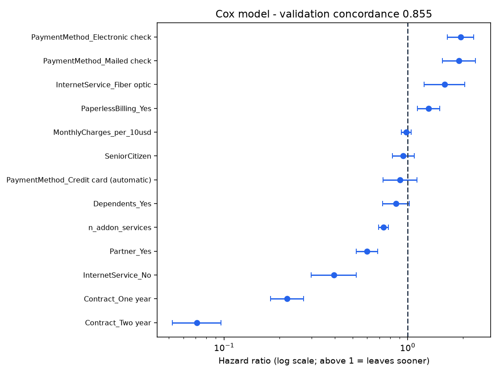

# Time to churn - survival analysis

7,032 customers; 11 with tenure 0 dropped (no observed time at risk). Clock = tenure in months; event = churned. Customers who had not churned are *censored*: we know they lasted at least their tenure, no more.

## Hazard vs probability

The classifier gives a **probability**: how likely this customer is flagged as churned in the snapshot. Survival analysis models the **hazard**: the rate of leaving *at a given tenure, among customers still active then*. A hazard ratio of 2 means "leaves at twice the rate at any given tenure", not "twice the probability of ever leaving". Hazards are what let us say *when*.

## Kaplan-Meier: share still active

**By Contract** (log-rank p < 1e-100)

| Contract | customers | churned | 12 mo | 24 mo | 36 mo | 60 mo | median |
|---|---|---|---|---|---|---|---|
| Month-to-month | 3,875 | 1,655 | 70.3% | 58.6% | 49.1% | 29.7% | 35 mo |
| One year | 1,472 | 166 | 99.1% | 97.8% | 95.9% | 83.2% | not reached |
| Two year | 1,685 | 48 | 100.0% | 100.0% | 99.9% | 98.6% | not reached |

**By InternetService** (log-rank p < 1e-100)

| InternetService | customers | churned | 12 mo | 24 mo | 36 mo | 60 mo | median |
|---|---|---|---|---|---|---|---|
| DSL | 2,416 | 459 | 86.8% | 83.1% | 81.5% | 76.1% | not reached |
| Fiber optic | 3,096 | 1,297 | 78.4% | 70.2% | 63.6% | 51.8% | 65 mo |
| No | 1,520 | 113 | 93.5% | 92.6% | 92.0% | 90.5% | not reached |

## Cox proportional-hazards model

Fit on the training split (4,218 customers), scored on validation (1,408). **Concordance: 0.855 on validation** (0.861 on train; 0.5 is chance, 1.0 is perfect ranking of who leaves first). Ridge penalty 0.01. `TotalCharges` is excluded because it is roughly tenure x monthly charge and would leak the clock into the covariates.

| Covariate | Hazard ratio | 95% CI | p |
|---|---|---|---|
| PaymentMethod_Electronic check | 1.94 | 1.64 to 2.29 | 4.8e-15 |
| PaymentMethod_Mailed check | 1.90 | 1.54 to 2.34 | 1.5e-09 |
| InternetService_Fiber optic | 1.58 | 1.23 to 2.04 | 0.00036 |
| PaperlessBilling_Yes | 1.30 | 1.13 to 1.49 | 0.00025 |
| MonthlyCharges_per_10usd | 0.98 | 0.92 to 1.04 | 0.56 |
| SeniorCitizen | 0.95 | 0.82 to 1.09 | 0.43 |
| PaymentMethod_Credit card (automatic) | 0.91 | 0.73 to 1.12 | 0.38 |
| Dependents_Yes | 0.86 | 0.73 to 1.02 | 0.087 |
| n_addon_services | 0.74 | 0.69 to 0.78 | 2e-22 |
| Partner_Yes | 0.60 | 0.52 to 0.69 | 1.1e-13 |
| InternetService_No | 0.40 | 0.30 to 0.52 | 1.4e-10 |
| Contract_One year | 0.22 | 0.18 to 0.27 | 5e-46 |
| Contract_Two year | 0.07 | 0.05 to 0.10 | 1.4e-65 |

## Is proportional hazards credible?

Schoenfeld-residual test (rank time transform), flagging p < 0.01:

**2 of 13 covariates violate the assumption:** `Contract_One year` (p = 0.0002), `n_addon_services` (p = 0.0002). For these, one hazard ratio is an average over a changing effect - the effect is not constant across tenure - so read them as a summary, not as a fixed multiplier. The Kaplan-Meier curves above do not assume proportionality and are the safer evidence for the contract and internet-service comparisons.

With several thousand customers this test flags even small departures, so a flag means "the effect varies with tenure", not necessarily "the model is unusable".

*Associations in observational data, not causal effects.*
